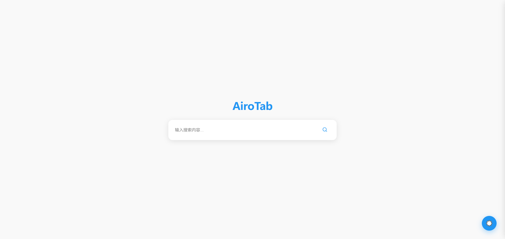
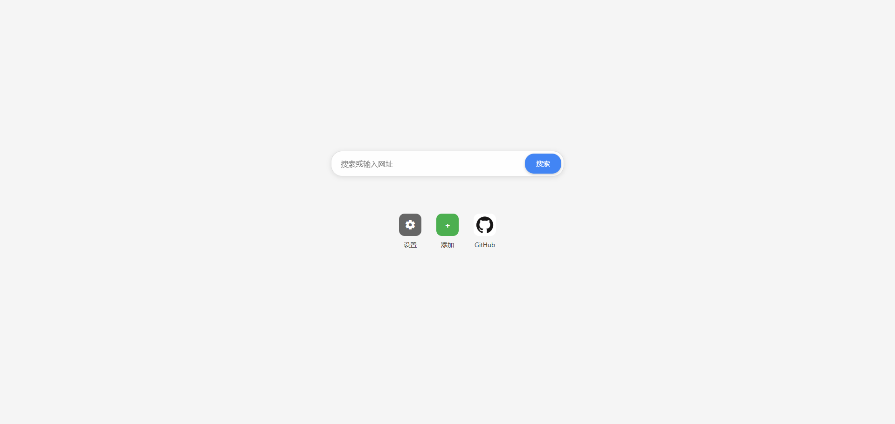
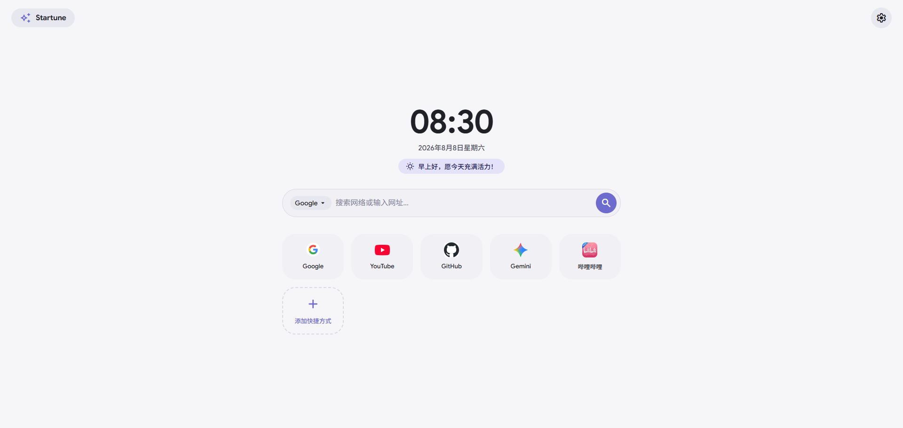

# 起始页之旅
我在很早之前就想要自己写一个浏览器起始页，那时正好碰上了AI技术的光速发展，所以我就用AI技术写了几个浏览器起始页，数量有三个

## 起始之AiroTab
> 2025Y 10M
> 

AiroTab是第一个我用AI写的起始页，那时我甚至是对它比较满意的，但我现在只觉得那是一坨屎
好在，那时我并没有把它给彻底删除掉，而是把它丢到我网站的old文件夹就不管了

所以，你现在仍然可以[访问它](../../AiroTab.html)

## 在那QingTab还未干枯的时候

> 

在2026年1月的时候，我放弃了AiroTab，并开始开发新的QingTab，但是由于那时我的Google AI Studio的API被封了，我只能被迫用Trae，而Trae也是一如既往的给我写一堆垃圾，但那时我别无选择，我只能硬着头皮用

但在它开发的差不多的时候，我就跟忘了它一样，一直去做其他的东西

而现在，回看起它……仍然一坨

但我依旧没删它，所以你还可以[访问它](../../QingTab.html)

## 终点在Startune

> 

我在2026年的8月7日，用着CherryStudio配Gemini3.6Flash，终于做出了一个我现在满意，我未来也应该会满意的起始页

你可以直接通过[`Stune.OnsY.qzz.io`](https://stune.onsy.qzz.io)来访问它